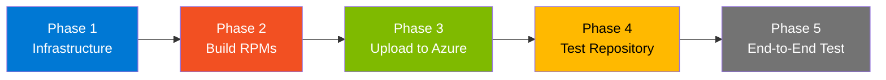
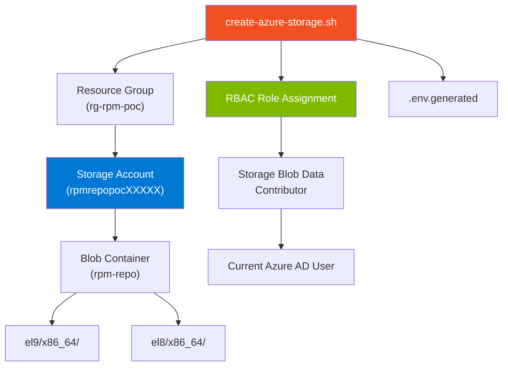
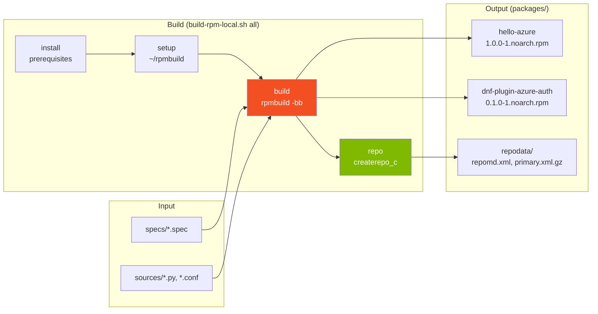
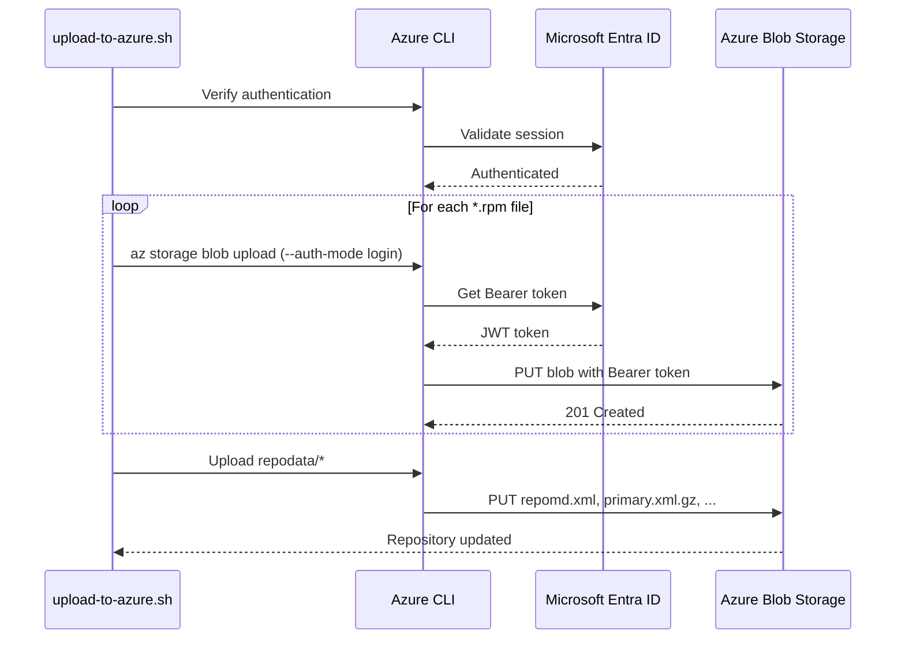
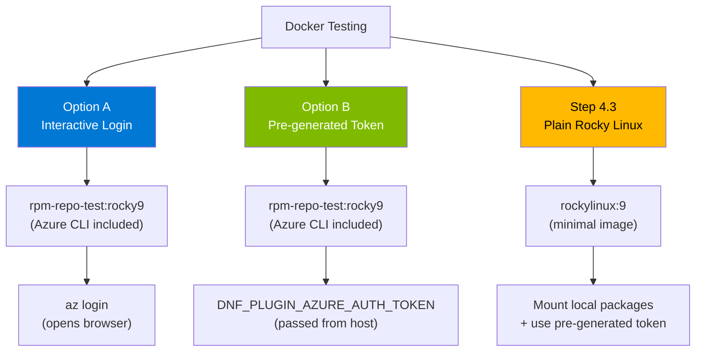
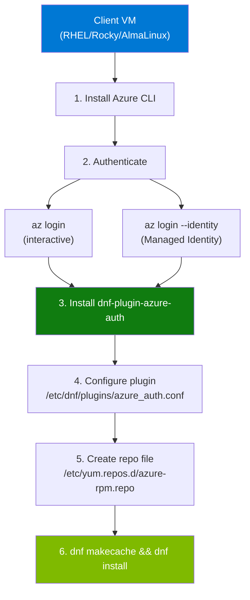
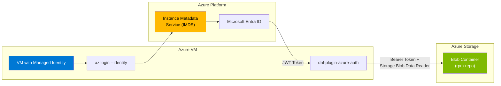

# RPM Repository POC - Quick Start Guide

## Step-by-Step Testing Instructions

This guide walks you through the complete process of setting up and testing the Azure Blob Storage RPM repository with **Azure AD authentication**.

### Pipeline Overview



---

## Quick Command Reference

All commands at a glance for experienced users:

```bash
# === PREREQUISITES ===
curl -sL https://aka.ms/InstallAzureCLIDeb | sudo bash    # Install Azure CLI (Debian/Ubuntu)
sudo apt-get install -y rpm createrepo-c                   # Install RPM build tools
az login                                                   # Login to Azure
az account set --subscription "YOUR_SUBSCRIPTION"          # Set subscription

# === PHASE 1: INFRASTRUCTURE ===
cd /mnt/c/dev/rpm-poc
chmod +x scripts/*.sh                                      # Make scripts executable
./scripts/create-azure-storage.sh -g rg-rpm-poc -l eastus  # Create Azure Storage with RBAC
source .env.generated                                      # Load environment variables

# === PHASE 2: BUILD ===
./scripts/build-rpm-local.sh all                           # Build all RPM packages
ls packages/*.rpm                                          # Verify built packages

# === PHASE 3: UPLOAD ===
./scripts/upload-to-azure.sh                               # Upload packages to Azure Blob

# === PHASE 4: TEST ===
./scripts/test-repository.sh -s $AZURE_STORAGE_ACCOUNT     # Test repository access

# Docker Test (with pre-built image)
docker build -f Dockerfile.rpm-test -t rpm-repo-test:rocky9 .
TOKEN=$(az account get-access-token --resource https://storage.azure.com --query accessToken -o tsv)
docker run --rm -it \
  -e DNF_PLUGIN_AZURE_AUTH_TOKEN="$TOKEN" \
  -e AZURE_STORAGE_ACCOUNT="$AZURE_STORAGE_ACCOUNT" \
  rpm-repo-test:rocky9 bash -c 'setup-azure-repo.sh && dnf install -y hello-azure && hello-azure --info'

# === PHASE 5: END-TO-END ===
./scripts/e2e-test.sh -g rg-rpm-poc                        # Full pipeline test

# === CLEANUP ===
az group delete --name rg-rpm-poc --yes --no-wait          # Delete all resources
```

---

## Prerequisites

### 1. Install Required Tools

```bash
# Update system package lists
sudo apt-get update

# Install Azure CLI - Microsoft's command-line tool for Azure management
# This downloads and runs the official Microsoft installation script
curl -sL https://aka.ms/InstallAzureCLIDeb | sudo bash

# Install RPM build tools (Debian/Ubuntu)
# - rpm: RPM package manager and rpmbuild tool
# - createrepo-c: Creates repository metadata (repomd.xml, primary.xml, etc.)
sudo apt-get install -y rpm createrepo-c

# Verify installations - check versions to confirm tools are installed
az --version          # Should show Azure CLI version (e.g., 2.x.x)
rpmbuild --version    # Should show rpmbuild version
createrepo_c --version # Should show createrepo_c version
```

### 2. Login to Azure

```bash
# Login to Azure - opens browser for authentication
# After login, your credentials are cached locally
az login

# List all subscriptions you have access to
# Useful to find the correct subscription name/ID
az account list --output table

# Set the active subscription for all subsequent commands
# Replace with your subscription name or ID from the list above
az account set --subscription "YOUR_SUBSCRIPTION_NAME_OR_ID"

# Verify the active subscription
az account show --output table
```

---

## Phase 1: Infrastructure Deployment

### What Gets Created



### Step 1.1: Create Azure Storage Account

```bash
# Navigate to the project directory
cd /mnt/c/dev/rpm-poc

# Make all scripts executable (required once after cloning)
chmod +x scripts/*.sh

# Create storage account with RBAC (Azure AD authentication)
# Options:
#   -g, --resource-group  : Azure resource group name (created if doesn't exist)
#   -l, --location        : Azure region (e.g., eastus, westus2, westeurope)
#   -s, --storage-account : Custom storage account name (optional, auto-generated if omitted)
./scripts/create-azure-storage.sh \
  --resource-group rg-rpm-poc \
  --location eastus
```

**What this script does:**
- Creates a resource group (if it doesn't exist)
- Creates a storage account with a unique name (e.g., `rpmrepopoc37333`)
- Creates a blob container named `rpm-repo`
- Disables anonymous public access (security best practice)
- Assigns **Storage Blob Data Contributor** role to your Azure AD user
- Creates placeholder directories for EL8 and EL9 repositories
- Generates `.env.generated` file with all configuration values

### Step 1.2: Verify Storage Account

After the script completes, you'll see output like:

```
==============================================
Storage Account Details
==============================================
Resource Group:    rg-rpm-poc
Storage Account:   rpmrepopoc37333
Container:         rpm-repo
Location:          eastus

Blob Endpoint:     https://rpmrepopoc37333.blob.core.windows.net
Repository URL:    https://rpmrepopoc37333.blob.core.windows.net/rpm-repo

Authentication:    Azure AD (RBAC)
Required Role:     Storage Blob Data Reader (for clients)
                   Storage Blob Data Contributor (for uploads)
```

### Step 1.3: Load Environment

```bash
# Source the generated environment file to set variables in current shell
# This sets: AZURE_STORAGE_ACCOUNT, AZURE_STORAGE_CONTAINER, AZURE_RESOURCE_GROUP, etc.
source .env.generated

# Verify the environment variables are set correctly
echo "Storage Account: $AZURE_STORAGE_ACCOUNT"
echo "Container: $AZURE_STORAGE_CONTAINER"
echo "Resource Group: $AZURE_RESOURCE_GROUP"

# View all generated environment variables
cat .env.generated
```

---

## Phase 2: Build RPM Packages

### Build Process



### Step 2.1: Build All Packages

```bash
# Build all RPM packages defined in specs/ directory
# This command performs: install prerequisites, setup environment, build, create repo metadata
# Available commands: install, setup, build, repo, clean, all
./scripts/build-rpm-local.sh all

# Alternative: Build individual packages
./scripts/build-rpm-local.sh build specs/hello-azure.spec           # Build only hello-azure
./scripts/build-rpm-local.sh build specs/dnf-plugin-azure-auth.spec # Build only the plugin

# Alternative: Run individual steps
./scripts/build-rpm-local.sh install   # Install rpmbuild prerequisites
./scripts/build-rpm-local.sh setup     # Setup ~/rpmbuild directory structure
./scripts/build-rpm-local.sh build     # Build all specs
./scripts/build-rpm-local.sh repo      # Create repository metadata
./scripts/build-rpm-local.sh clean     # Clean build artifacts
```

**Expected Output:**
```
[INFO] Setting up RPM build environment...
[INFO] Copying source files to build environment...
[SUCCESS] Build environment ready

[INFO] Building RPM from: specs/hello-azure.spec
[SUCCESS] Built: hello-azure-1.0.0-1.noarch.rpm

[INFO] Building RPM from: specs/dnf-plugin-azure-auth.spec
[SUCCESS] Built: dnf-plugin-azure-auth-0.1.0-1.noarch.rpm

[INFO] Creating repository metadata...
[SUCCESS] Repository metadata created

Package Summary:
  hello-azure-1.0.0-1.noarch.rpm
  dnf-plugin-azure-auth-0.1.0-1.noarch.rpm
```

### Step 2.2: Verify Built Packages

```bash
# List the built RPM packages
ls -la packages/
# Expected output:
#   hello-azure-1.0.0-1.noarch.rpm        - Sample test package
#   dnf-plugin-azure-auth-0.1.0-1.noarch.rpm - Azure AD authentication plugin
#   repodata/                              - Repository metadata directory

# Inspect package details
rpm -qip packages/hello-azure-1.0.0-1.noarch.rpm           # Package info
rpm -qlp packages/hello-azure-1.0.0-1.noarch.rpm           # List files in package

# Inspect plugin package dependencies
rpm -qpR packages/dnf-plugin-azure-auth-0.1.0-1.noarch.rpm # List requirements

# Verify repository metadata was created
ls packages/repodata/
# Expected: repomd.xml, primary.xml.gz, filelists.xml.gz, other.xml.gz, etc.
```

---

## Phase 3: Upload to Azure Blob Storage

### Upload Flow



### Step 3.1: Upload Packages

```bash
# Ensure environment variables are loaded
source .env.generated

# Upload packages using Azure AD authentication (no SAS tokens needed)
# This uploads RPMs and repodata to: ${AZURE_STORAGE_ACCOUNT}/${AZURE_STORAGE_CONTAINER}/el9/x86_64/
./scripts/upload-to-azure.sh

# Alternative: Specify options explicitly
./scripts/upload-to-azure.sh \
  --storage-account $AZURE_STORAGE_ACCOUNT \
  --container rpm-repo \
  --repo-path el9/x86_64 \
  --packages-dir ./packages
```

**What this script does:**
- Verifies Azure AD authentication is working
- Uploads all `*.rpm` files from `packages/` directory
- Uploads repository metadata from `packages/repodata/`
- Uses Azure AD Bearer tokens (not SAS tokens) for authentication

**Expected Output:**
```
[INFO] Verifying Azure AD authentication...
[SUCCESS] Azure AD authentication verified

[INFO] Uploading RPM packages from: /mnt/c/dev/rpm-poc/packages
[INFO] Uploading: hello-azure-1.0.0-1.noarch.rpm
[INFO] Uploading: dnf-plugin-azure-auth-0.1.0-1.noarch.rpm
[SUCCESS] Uploaded 2 RPM package(s)

[INFO] Updating repository metadata...
[SUCCESS] Repository metadata updated
```

### Step 3.2: Verify Upload

```bash
# List all uploaded blobs (using Azure AD authentication)
az storage blob list \
  --account-name $AZURE_STORAGE_ACCOUNT \
  --container-name $AZURE_STORAGE_CONTAINER \
  --auth-mode login \
  --output table

# List only the RPM packages
az storage blob list \
  --account-name $AZURE_STORAGE_ACCOUNT \
  --container-name $AZURE_STORAGE_CONTAINER \
  --prefix "el9/x86_64/" \
  --auth-mode login \
  --query "[?ends_with(name, '.rpm')].{Name:name, Size:properties.contentLength}" \
  --output table

# Test direct HTTP access with Azure AD token
TOKEN=$(az account get-access-token --resource https://storage.azure.com --query accessToken -o tsv)
curl -s -o /dev/null -w "%{http_code}" \
  -H "Authorization: Bearer $TOKEN" \
  -H "x-ms-version: 2022-11-02" \
  "https://$AZURE_STORAGE_ACCOUNT.blob.core.windows.net/$AZURE_STORAGE_CONTAINER/el9/x86_64/repodata/repomd.xml"
# Expected: 200 (success)
```

---

## Phase 4: Test Repository Access

### Step 4.1: Run Repository Tests

```bash
# Run automated repository tests
# Options:
#   -s, --storage-account : Storage account name
#   -c, --container       : Container name (default: rpm-repo)
#   -r, --repo-path       : Repository path (default: el9/x86_64)
#   -v, --verbose         : Show detailed output
./scripts/test-repository.sh -s $AZURE_STORAGE_ACCOUNT -v

# The script tests:
# - Azure AD token acquisition
# - repomd.xml accessibility (HTTP 200)
# - RPM package listing
# - Anonymous access blocked (security verification)
```

**Expected Output:**
```
==============================================
Azure Blob RPM Repository Tests
==============================================
Storage Account: rpmrepopoc37333
Container:       rpm-repo
Repo Path:       el9/x86_64

[INFO] Getting Azure AD access token...
[SUCCESS] Azure AD token obtained

--- Testing Repository Access ---
[SUCCESS] repomd.xml accessible (HTTP 200)
[SUCCESS] Found 2 RPM package(s)
[SUCCESS] Found 4 repodata file(s)

--- Security Tests ---
[SUCCESS] Anonymous access blocked (HTTP 409) - Security OK

==============================================
Test Summary
==============================================
Passed: 5
Failed: 0

[SUCCESS] All tests passed! Repository is ready for use.
```

### Step 4.2: Test with Docker (Using Pre-built Test Image)

We provide a Docker image with Azure CLI pre-installed for more realistic testing.

#### Testing Options



#### Build the Test Image

```bash
# Build the test image with Azure CLI and the plugin pre-installed
# Image includes:
#   - Rocky Linux 9 base
#   - Azure CLI (pip installed for cross-architecture support)
#   - dnf-plugin-azure-auth pre-installed
#   - setup-azure-repo.sh helper script
docker build -f Dockerfile.rpm-test -t rpm-repo-test:rocky9 .

# Verify the image was built
docker images rpm-repo-test:rocky9
```

#### Option A: Interactive Login (Recommended for Development)

```bash
# Load environment variables
source .env.generated

# Run container interactively with Azure storage account configured
docker run --rm -it \
  -e AZURE_STORAGE_ACCOUNT="$AZURE_STORAGE_ACCOUNT" \
  rpm-repo-test:rocky9

# === Inside the container ===

# Login to Azure (opens browser for authentication)
az login

# Configure the repository using the helper script
# This creates /etc/yum.repos.d/azure-rpm.repo and configures the plugin
setup-azure-repo.sh

# Refresh repository cache
dnf makecache

# List available packages from Azure repo
dnf --disablerepo="*" --enablerepo="azure-rpm-repo" list available

# Install the test package from Azure Blob Storage
dnf install -y hello-azure

# Run the installed package to verify
hello-azure --info

# Exit the container
exit
```

#### Option B: Pre-generated Token (CI/CD or Headless)

```bash
# Load environment variables
source .env.generated

# Generate Azure AD token on host machine
# This token is valid for ~1 hour and grants access to Azure Blob Storage
TOKEN=$(az account get-access-token --resource https://storage.azure.com --query accessToken -o tsv)

# Verify token was obtained (should show JWT header starting with 'eyJ')
echo "${TOKEN:0:10}..."

# Run container with pre-generated token (no interactive login needed)
# DNF_PLUGIN_AZURE_AUTH_TOKEN: Plugin uses this token instead of calling az cli
# AZURE_STORAGE_ACCOUNT: Used by setup-azure-repo.sh to configure baseurl
docker run --rm -it \
  -e DNF_PLUGIN_AZURE_AUTH_TOKEN="$TOKEN" \
  -e AZURE_STORAGE_ACCOUNT="$AZURE_STORAGE_ACCOUNT" \
  rpm-repo-test:rocky9 bash -c '
    setup-azure-repo.sh
    dnf makecache
    dnf --disablerepo="*" --enablerepo="azure-rpm-repo" list available
    dnf install -y hello-azure
    hello-azure --info
'
```

> **Note**: Pre-generated tokens are ideal for:
> - CI/CD pipelines where interactive login isn't possible
> - Headless servers without browser access
> - Bootstrapping new VMs before Azure CLI is installed

### Step 4.3: Test with Plain Rocky Linux (Minimal - Token Only)

For scenarios where you want a minimal image without Azure CLI pre-installed:

```bash
# Load environment and generate token
source .env.generated
TOKEN=$(az account get-access-token --resource https://storage.azure.com --query accessToken -o tsv)

# Run with plain Rocky Linux (no Azure CLI)
# This demonstrates the bootstrap scenario where you install the plugin first
docker run --rm -it \
  -e DNF_PLUGIN_AZURE_AUTH_TOKEN="$TOKEN" \
  -e AZURE_STORAGE_ACCOUNT="$AZURE_STORAGE_ACCOUNT" \
  -v $(pwd)/packages:/packages:ro \
  rockylinux:9 bash -c '
    # Install the Azure AD authentication plugin from local mount
    # The plugin has no hard dependencies on azure-cli
    dnf install -y /packages/dnf-plugin-azure-auth-*.rpm
    
    # Configure the plugin to enable Azure AD auth for our repo
    # This adds the repo ID to the plugin configuration
    echo "[azure-rpm-repo]" >> /etc/dnf/plugins/azure_auth.conf
    
    # Create the repository configuration file
    # baseurl points to your Azure Blob Storage container
    cat > /etc/yum.repos.d/azure.repo << EOF
[azure-rpm-repo]
name=Azure Blob RPM Repository
baseurl=https://${AZURE_STORAGE_ACCOUNT}.blob.core.windows.net/rpm-repo/el9/x86_64
enabled=1
gpgcheck=0
EOF

    # Test: refresh metadata and install package
    dnf makecache
    dnf install -y hello-azure
    hello-azure --info
'
```

> **Note**: This method requires a pre-generated token since Azure CLI is not installed.
> The plugin detects `DNF_PLUGIN_AZURE_AUTH_TOKEN` and uses it for authentication.

---

## Phase 5: End-to-End Test

Run the complete pipeline with a single command:

```bash
# Full E2E test - creates infrastructure, builds, uploads, and tests
# Options:
#   -g, --resource-group  : Azure resource group (required if creating storage)
#   -s, --storage-account : Use existing storage account
#   --skip-storage        : Skip storage creation (use with -s)
#   --skip-build          : Skip package building
#   --skip-upload         : Skip package upload
./scripts/e2e-test.sh -g rg-rpm-poc

# Use existing storage account (skip storage creation)
./scripts/e2e-test.sh -s $AZURE_STORAGE_ACCOUNT --skip-storage

# Skip build (use pre-built packages)
./scripts/e2e-test.sh -s $AZURE_STORAGE_ACCOUNT --skip-storage --skip-build
```

---

## Client Configuration Guide

### Client Setup Flow



### For RHEL/Rocky Linux/AlmaLinux VMs

Complete setup instructions for configuring a client VM to use the Azure Blob RPM repository:

```bash
# ============================================================
# STEP 1: Install Azure CLI from Microsoft repository
# ============================================================
# Import Microsoft's GPG key for package verification
sudo rpm --import https://packages.microsoft.com/keys/microsoft.asc

# Add Microsoft's Azure CLI repository
sudo dnf config-manager --add-repo https://packages.microsoft.com/yumrepos/azure-cli

# Install Azure CLI
sudo dnf install -y azure-cli

# Verify installation
az --version

# ============================================================
# STEP 2: Login to Azure
# ============================================================
# Option A: Interactive login (opens browser)
az login

# Option B: Managed Identity login (Azure VMs only - no credentials needed)
az login --identity

# Verify login
az account show

# ============================================================
# STEP 3: Install the Azure AD auth plugin
# ============================================================
# Get an Azure AD token for storage access
TOKEN=$(az account get-access-token --resource https://storage.azure.com --query accessToken -o tsv)

# Download the plugin RPM directly using the token
# Replace STORAGE_ACCOUNT with your actual storage account name
curl -H "Authorization: Bearer $TOKEN" -H "x-ms-version: 2022-11-02" \
  "https://STORAGE_ACCOUNT.blob.core.windows.net/rpm-repo/el9/x86_64/dnf-plugin-azure-auth-0.1.0-1.noarch.rpm" \
  -o /tmp/dnf-plugin-azure-auth.rpm

# Install the plugin
sudo dnf install -y /tmp/dnf-plugin-azure-auth.rpm

# ============================================================
# STEP 4: Configure the plugin
# ============================================================
# Add your repository ID to the plugin configuration
# This tells the plugin to add Azure AD tokens to requests for this repo
sudo tee -a /etc/dnf/plugins/azure_auth.conf << 'EOF'
[azure-rpm-repo]
EOF

# Verify plugin configuration
cat /etc/dnf/plugins/azure_auth.conf

# ============================================================
# STEP 5: Create repository configuration
# ============================================================
# Create the repo file - replace YOUR_STORAGE_ACCOUNT with actual value
sudo tee /etc/yum.repos.d/azure-rpm.repo << 'EOF'
[azure-rpm-repo]
name=Azure Blob RPM Repository
baseurl=https://YOUR_STORAGE_ACCOUNT.blob.core.windows.net/rpm-repo/el9/x86_64
enabled=1
gpgcheck=0
EOF

# ============================================================
# STEP 6: Test the repository
# ============================================================
# Refresh repository cache - plugin automatically adds Azure AD token
sudo dnf makecache

# List available packages from Azure repo
sudo dnf --disablerepo="*" --enablerepo="azure-rpm-repo" list available

# Install a package
sudo dnf install -y hello-azure

# Verify the installation
hello-azure --info
```

### For Azure VMs with Managed Identity

Azure VMs with Managed Identity can authenticate without storing credentials:

#### Managed Identity Architecture



```bash
# ============================================================
# Prerequisites: VM must have System-assigned Managed Identity enabled
# ============================================================

# Check if Managed Identity is enabled on the VM
az vm show -g YOUR_RG -n YOUR_VM --query identity

# If not enabled, enable it:
az vm identity assign -g YOUR_RG -n YOUR_VM

# ============================================================
# STEP 1: Assign Storage Blob Data Reader role to VM's Managed Identity
# ============================================================
# Get the VM's Managed Identity principal ID
VM_PRINCIPAL_ID=$(az vm show -g YOUR_RG -n YOUR_VM --query identity.principalId -o tsv)

# Get the storage account resource ID
STORAGE_ACCOUNT_ID=$(az storage account show -n YOUR_STORAGE_ACCOUNT -g YOUR_RG --query id -o tsv)

# Assign the Storage Blob Data Reader role
# This allows the VM to read blobs using its Managed Identity
az role assignment create \
  --role "Storage Blob Data Reader" \
  --assignee-object-id $VM_PRINCIPAL_ID \
  --assignee-principal-type ServicePrincipal \
  --scope $STORAGE_ACCOUNT_ID

# Verify the role assignment
az role assignment list --scope $STORAGE_ACCOUNT_ID --output table

# ============================================================
# STEP 2: On the VM - Login with Managed Identity
# ============================================================
# SSH into the VM
ssh azureuser@<VM_IP_ADDRESS>

# Login using Managed Identity (no credentials needed!)
az login --identity

# Verify - should show the subscription
az account show

# ============================================================
# STEP 3: Configure plugin and repo (same as above)
# ============================================================
# The plugin will automatically use 'az account get-access-token'
# which works with Managed Identity

# Configure plugin
sudo tee -a /etc/dnf/plugins/azure_auth.conf << 'EOF'
[azure-rpm-repo]
EOF

# Create repo file
sudo tee /etc/yum.repos.d/azure-rpm.repo << 'EOF'
[azure-rpm-repo]
name=Azure Blob RPM Repository
baseurl=https://YOUR_STORAGE_ACCOUNT.blob.core.windows.net/rpm-repo/el9/x86_64
enabled=1
gpgcheck=0
EOF

# ============================================================
# STEP 4: Test - tokens are fetched automatically via Managed Identity
# ============================================================
sudo dnf makecache
sudo dnf install -y hello-azure
hello-azure --info
```

> **Security Best Practice**: Managed Identity eliminates the need to store credentials
> on the VM. The Azure platform automatically manages the identity lifecycle.

---

## Verification Checklist

| Step | Command | Expected Result |
|------|---------|-----------------|
| Azure Login | `az account show` | Shows your subscription |
| Storage Created | `az storage account show -n $AZURE_STORAGE_ACCOUNT` | Returns account details |
| RBAC Role | `az role assignment list --scope ... --query "[?roleDefinitionName=='Storage Blob Data Contributor']"` | Shows role assignment |
| Packages Built | `ls packages/*.rpm` | Shows RPM files |
| Repo Metadata | `ls packages/repodata/` | Shows repomd.xml, etc. |
| Blobs Uploaded | `az storage blob list -c $AZURE_STORAGE_CONTAINER --account-name $AZURE_STORAGE_ACCOUNT --auth-mode login` | Shows uploaded files |
| Azure AD Token | `az account get-access-token --resource https://storage.azure.com` | Returns valid token |
| Token Access | `curl -H "Authorization: Bearer $TOKEN" -H "x-ms-version: 2022-11-02" https://...repomd.xml` | Returns XML content |

---

## Troubleshooting

### Error: "AuthorizationPermissionMismatch"

```bash
# Verify role assignment
az role assignment list \
  --scope $(az storage account show -n $AZURE_STORAGE_ACCOUNT -g $AZURE_RESOURCE_GROUP --query id -o tsv) \
  --output table

# Assign Storage Blob Data Reader/Contributor if missing
az role assignment create \
  --role "Storage Blob Data Contributor" \
  --assignee $(az ad signed-in-user show --query id -o tsv) \
  --scope $(az storage account show -n $AZURE_STORAGE_ACCOUNT -g $AZURE_RESOURCE_GROUP --query id -o tsv)
```

### Error: "Failed to get Azure AD token"

```bash
# Check Azure CLI login status
az account show

# Re-login if needed
az login

# For Managed Identity issues
az login --identity --debug
```

### Error: "403 Forbidden" when accessing blobs

```bash
# Verify the token is valid
TOKEN=$(az account get-access-token --resource https://storage.azure.com --query accessToken -o tsv)
echo $TOKEN | cut -c1-50  # Should show JWT header

# Test direct access
curl -v -H "Authorization: Bearer $TOKEN" -H "x-ms-version: 2022-11-02" \
  "https://$AZURE_STORAGE_ACCOUNT.blob.core.windows.net/$AZURE_STORAGE_CONTAINER/el9/x86_64/repodata/repomd.xml"
```

### Error: "repomd.xml not found"

```bash
# Check if repository metadata was uploaded
az storage blob list \
  --account-name $AZURE_STORAGE_ACCOUNT \
  --container-name $AZURE_STORAGE_CONTAINER \
  --prefix "el9/x86_64/repodata/" \
  --auth-mode login \
  --output table

# If missing, regenerate and upload
createrepo_c packages/
./scripts/upload-to-azure.sh
```

---

## Clean Up

```bash
# Delete the resource group (removes all resources)
az group delete --name rg-rpm-poc --yes --no-wait
```

---

## Files Reference

| File | Purpose |
|------|---------|
| `scripts/create-azure-storage.sh` | Creates Azure storage with RBAC |
| `scripts/build-rpm-local.sh` | Builds RPM packages locally |
| `scripts/upload-to-azure.sh` | Uploads to Azure Blob (Azure AD) |
| `scripts/test-repository.sh` | Tests repository access |
| `scripts/e2e-test.sh` | Full pipeline test |
| `specs/hello-azure.spec` | Sample RPM spec file |
| `specs/dnf-plugin-azure-auth.spec` | Azure AD auth plugin spec |
| `sources/azure_auth.py` | DNF plugin Python source |
| `sources/azure_auth.conf` | Plugin configuration template |
| `config/azure-blob.repo.template` | Repo configuration template |

---

## Next Steps

1. **Add GPG Signing**: Sign packages for production use
2. **Multiple Architectures**: Add support for aarch64
3. **Azure DevOps Pipeline**: See [azure-pipelines.yml](azure-pipelines.yml)
4. **Private Endpoints**: For VNet-restricted access
5. **Monitoring**: Add Azure Monitor alerts for access issues
