# Azure Blob Storage RPM Repository POC

## Overview

This repository provides a complete solution for hosting RPM packages on Azure Blob Storage using **Azure AD authentication** (no SAS tokens or storage keys). It is designed for enterprise environments where:

- **SAS tokens and storage keys are blocked** by Azure Policy
- **Public blob access is disabled** for security compliance
- **RBAC-based access control** is required
- **Managed Identities** are preferred for Azure VMs

### Key Components

| Component | Purpose |
|-----------|---------|
| Azure Blob Storage | Host RPM packages and repository metadata |
| Azure AD (Entra ID) | Secure access via RBAC roles |
| `dnf-plugin-azure-auth` | DNF plugin that injects Azure AD Bearer tokens into repo requests |
| `createrepo_c` | Generate yum/dnf repository metadata |

---

## Repository Structure

```
rpm-poc/
├── README.md                           # This file (comprehensive guide)
├── azure-pipelines.yml                 # Azure DevOps CI/CD pipeline
├── docker-compose.yml                  # Multi-container test environment
├── Dockerfile.rpm-builder              # Rocky Linux 8 RPM build image
├── Dockerfile.rpm-test                 # Rocky Linux 9 test client image
├── .env.example                        # Environment variable template
├── scripts/
│   ├── create-azure-storage.sh         # Create Azure Storage with RBAC
│   ├── build-rpm-local.sh              # Local RPM build script
│   ├── upload-to-azure.sh              # Upload to Azure Blob (Azure AD)
│   ├── test-repository.sh              # Repository access test script
│   ├── e2e-test.sh                     # End-to-end pipeline test
│   ├── deploy-test-vm.sh              # Deploy RHEL 9 VM with Managed Identity
│   ├── test-vm-managed-identity.sh    # Test managed identity workflow on VM
│   ├── generate-random-rpms.sh        # Generate random test packages
│   └── docker-build-and-upload.sh     # Docker container build & upload script
├── config/
│   └── azure-blob.repo.template        # Repository configuration template
├── sources/
│   ├── azure_auth.py                   # DNF Azure AD auth plugin source
│   └── azure_auth.conf                 # Plugin configuration template
├── packages/                           # Built RPM packages (generated)
└── specs/
    ├── hello-azure.spec                # Sample test RPM spec
    ├── dnf-plugin-azure-auth.spec      # Azure AD auth plugin spec
    └── random-*.spec                   # Auto-generated test package specs
```

---

## Architecture

### High-Level Architecture

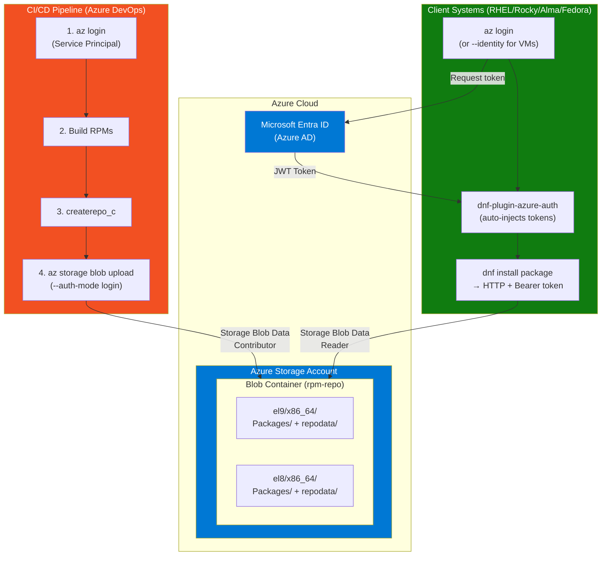

### Repository URL Structure

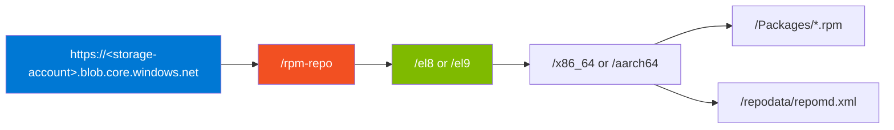

### Authentication Flow

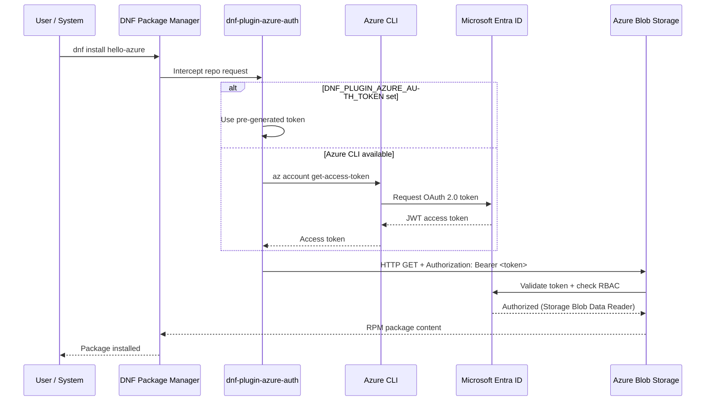

1. **dnf-plugin-azure-auth** intercepts repository requests to Azure Blob Storage URLs
2. The plugin obtains an Azure AD token via `az account get-access-token` or `DNF_PLUGIN_AZURE_AUTH_TOKEN` env var
3. Requests are modified to include `Authorization: Bearer <token>` and `x-ms-version: 2022-11-02` headers
4. Azure Blob Storage validates the token against RBAC and serves the content

### RBAC Roles

| Role | Purpose | Scope |
|------|---------|-------|
| **Storage Blob Data Contributor** | Upload packages, update repository (CI/CD, admins) | Storage Account or Container |
| **Storage Blob Data Reader** | Download packages (client systems) | Storage Account or Container |

### Token Acquisition Methods

| Method | Use Case | Command |
|--------|----------|---------|
| Interactive Login | Development, testing | `az login` |
| Device Code | Headless systems | `az login --use-device-code` |
| Service Principal | CI/CD pipelines | `az login --service-principal` |
| Managed Identity | Azure VMs | `az login --identity` |
| Pre-generated Token | Bootstrapping, containers | `export DNF_PLUGIN_AZURE_AUTH_TOKEN="$TOKEN"` |

---

## Pipeline Overview

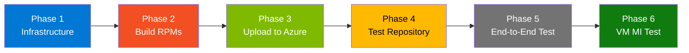

---

## Quick Command Reference

All commands at a glance for experienced users:

```bash
# === PREREQUISITES ===
curl -sL https://aka.ms/InstallAzureCLIDeb | sudo bash    # Install Azure CLI (Debian/Ubuntu)
sudo apt-get install -y rpm createrepo-c                   # Install RPM build tools
az login                                                   # Login to Azure
az account set --subscription "YOUR_SUBSCRIPTION"          # Set subscription

# === PHASE 1: INFRASTRUCTURE ===
chmod +x scripts/*.sh                                      # Make scripts executable
./scripts/create-azure-storage.sh -g rg-rpm-poc -l eastus  # Create Azure Storage with RBAC
source .env.generated                                      # Load environment variables

# === PHASE 2: BUILD ===
./scripts/build-rpm-local.sh all                           # Build all RPM packages
ls packages/*.rpm                                          # Verify built packages

# === BONUS: RANDOM PACKAGES ===
./scripts/generate-random-rpms.sh -n 5                     # Generate 5 random packages
./scripts/generate-random-rpms.sh --all -n 5               # Generate, build, and upload
./scripts/generate-random-rpms.sh --cleanup                # Remove generated packages

# === PHASE 3: UPLOAD ===
./scripts/upload-to-azure.sh                               # Upload packages to Azure Blob

# === PHASE 4: TEST ===
./scripts/test-repository.sh -s $AZURE_STORAGE_ACCOUNT     # Test repository access

# Docker Test (with pre-built image)
docker build -f Dockerfile.rpm-test -t rpm-repo-test:rocky9 .
TOKEN=$(az account get-access-token --resource https://storage.azure.com --query accessToken -o tsv)
docker run --rm -it \
  -e DNF_PLUGIN_AZURE_AUTH_TOKEN="$TOKEN" \
  -e AZURE_STORAGE_ACCOUNT="$AZURE_STORAGE_ACCOUNT" \
  rpm-repo-test:rocky9 bash -c 'setup-azure-repo.sh && dnf install -y hello-azure && hello-azure --info'

# === PHASE 5: END-TO-END ===
./scripts/e2e-test.sh -g rg-rpm-poc                        # Full pipeline test

# === PHASE 6: VM MANAGED IDENTITY TEST ===
sudo apt-get install -y sshpass                             # Required for SSH automation
./scripts/deploy-test-vm.sh                                 # Deploy RHEL 9 VM with MI
./scripts/test-vm-managed-identity.sh                       # Test managed identity workflow

# === USEFUL DNF COMMANDS (on VM or in Docker) ===
sudo dnf clean metadata && sudo dnf makecache                                      # Refresh metadata
sudo dnf --disablerepo="*" --enablerepo="azure-rpm-repo" list available            # List available packages
sudo dnf --disablerepo="*" --enablerepo="azure-rpm-repo" list installed            # List installed packages
sudo dnf --disablerepo="*" --enablerepo="azure-rpm-repo" info <package-name>       # Package details
sudo dnf makecache -v                                                              # Verbose (shows Azure AD token info)

# === CLEANUP ===
az group delete --name rg-rpm-poc --yes --no-wait          # Delete all resources
```

---

## Prerequisites

### Install Required Tools

```bash
# Update system package lists
sudo apt-get update

# Install Azure CLI
curl -sL https://aka.ms/InstallAzureCLIDeb | sudo bash

# Install RPM build tools (Debian/Ubuntu)
sudo apt-get install -y rpm createrepo-c

# Verify installations
az --version           # Azure CLI version
rpmbuild --version     # rpmbuild version
createrepo_c --version # createrepo_c version
```

### Login to Azure

```bash
# Login to Azure (opens browser for authentication)
az login

# List all subscriptions
az account list --output table

# Set the active subscription
az account set --subscription "YOUR_SUBSCRIPTION_NAME_OR_ID"

# Verify the active subscription
az account show --output table
```

---

## Phase 1: Infrastructure Deployment

### What Gets Created

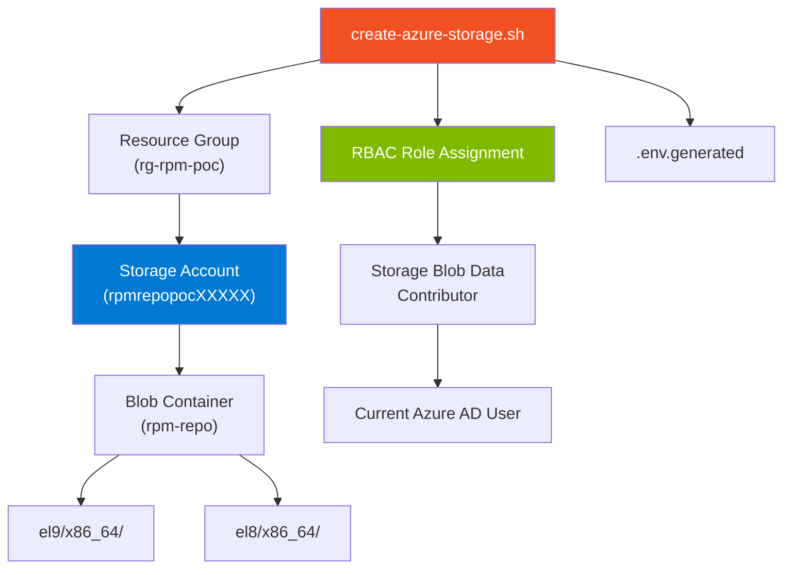

### Using the Setup Script

```bash
# Create storage account with RBAC (Azure AD authentication)
# Options:
#   -g, --resource-group  : Azure resource group name (created if doesn't exist)
#   -l, --location        : Azure region (e.g., eastus, westus2, westeurope)
#   -s, --storage-account : Custom storage account name (optional, auto-generated if omitted)
./scripts/create-azure-storage.sh \
  --resource-group rg-rpm-poc \
  --location eastus
```

**What this script does:**
- Creates a resource group (if it doesn't exist)
- Creates a storage account with a unique name (e.g., `rpmrepopoc37333`)
- Creates a blob container named `rpm-repo`
- Disables anonymous public access (security best practice)
- Assigns **Storage Blob Data Contributor** role to your Azure AD user
- Creates placeholder directories for EL8 and EL9 repositories
- Generates `.env.generated` file with all configuration values

### Manual Setup (Alternative)

```bash
RESOURCE_GROUP="rg-rpm-repo"
STORAGE_ACCOUNT="rpmrepo$(date +%s | tail -c 6)"
CONTAINER_NAME="rpm-repo"
LOCATION="eastus"

az group create --name $RESOURCE_GROUP --location $LOCATION

az storage account create \
  --name $STORAGE_ACCOUNT \
  --resource-group $RESOURCE_GROUP \
  --location $LOCATION \
  --sku Standard_LRS \
  --kind StorageV2 \
  --https-only true \
  --min-tls-version TLS1_2

az storage container create \
  --name $CONTAINER_NAME \
  --account-name $STORAGE_ACCOUNT \
  --auth-mode login

USER_ID=$(az ad signed-in-user show --query id -o tsv)
STORAGE_ID=$(az storage account show -n $STORAGE_ACCOUNT -g $RESOURCE_GROUP --query id -o tsv)

az role assignment create \
  --role "Storage Blob Data Contributor" \
  --assignee $USER_ID \
  --scope $STORAGE_ID
```

### Load Environment

```bash
# Source the generated environment file
source .env.generated

# Verify
echo "Storage Account: $AZURE_STORAGE_ACCOUNT"
echo "Container: $AZURE_STORAGE_CONTAINER"
echo "Resource Group: $AZURE_RESOURCE_GROUP"
```

---

## Phase 2: Build RPM Packages

### Build Process

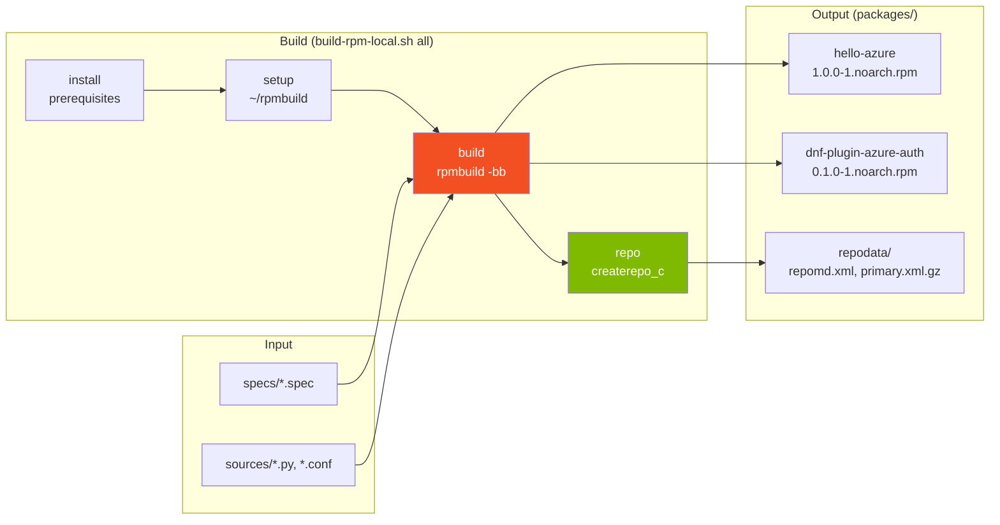

### Build All Packages

```bash
# Build all RPM packages defined in specs/ directory
# Available commands: install, setup, build, repo, clean, all
./scripts/build-rpm-local.sh all

# Alternative: Build individual packages
./scripts/build-rpm-local.sh build specs/hello-azure.spec
./scripts/build-rpm-local.sh build specs/dnf-plugin-azure-auth.spec

# Alternative: Run individual steps
./scripts/build-rpm-local.sh install   # Install rpmbuild prerequisites
./scripts/build-rpm-local.sh setup     # Setup ~/rpmbuild directory structure
./scripts/build-rpm-local.sh build     # Build all specs
./scripts/build-rpm-local.sh repo      # Create repository metadata
./scripts/build-rpm-local.sh clean     # Clean build artifacts
```

### Verify Built Packages

```bash
ls -la packages/
rpm -qip packages/hello-azure-1.0.0-1.noarch.rpm           # Package info
rpm -qlp packages/hello-azure-1.0.0-1.noarch.rpm           # List files in package
rpm -qpR packages/dnf-plugin-azure-auth-0.1.0-1.noarch.rpm # List requirements
ls packages/repodata/                                       # Verify repo metadata
```

### Generate Random Test Packages

Quickly generate randomly-named RPM packages with fun animal/color combinations for testing.

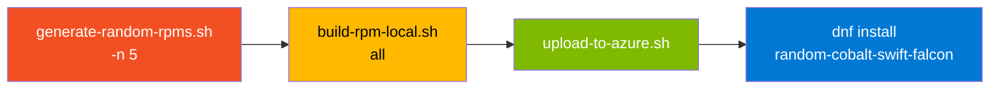

```bash
# One-liner: generate 5 random packages, build, create repo, upload
./scripts/generate-random-rpms.sh --all -n 5

# Step by step
./scripts/generate-random-rpms.sh -n 5          # Generate random spec files
./scripts/build-rpm-local.sh all                 # Build all packages
./scripts/upload-to-azure.sh                     # Upload to Azure

# Cleanup
./scripts/generate-random-rpms.sh --cleanup      # Remove generated specs and RPMs
./scripts/build-rpm-local.sh all                 # Rebuild repo without random packages
./scripts/upload-to-azure.sh                     # Re-upload
```

---

## Phase 3: Upload to Azure Blob Storage

### Upload Flow

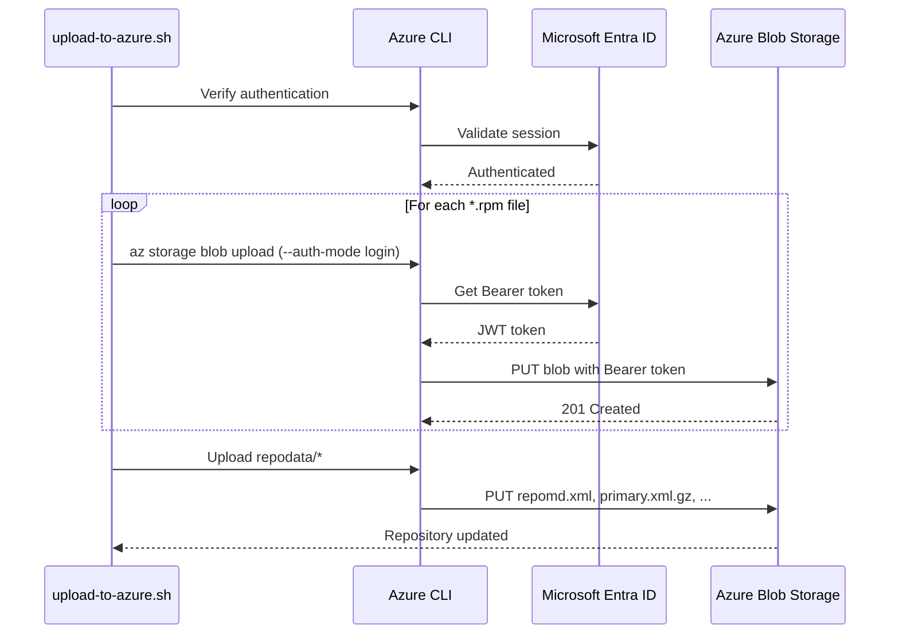

### Upload Packages

```bash
source .env.generated

# Upload packages using Azure AD authentication
./scripts/upload-to-azure.sh

# Or with explicit options
./scripts/upload-to-azure.sh \
  --storage-account $AZURE_STORAGE_ACCOUNT \
  --container rpm-repo \
  --repo-path el9/x86_64 \
  --packages-dir ./packages
```

### Verify Upload

```bash
# List all uploaded blobs
az storage blob list \
  --account-name $AZURE_STORAGE_ACCOUNT \
  --container-name $AZURE_STORAGE_CONTAINER \
  --auth-mode login \
  --output table

# List only RPM packages
az storage blob list \
  --account-name $AZURE_STORAGE_ACCOUNT \
  --container-name $AZURE_STORAGE_CONTAINER \
  --prefix "el9/x86_64/" \
  --auth-mode login \
  --query "[?ends_with(name, '.rpm')].{Name:name, Size:properties.contentLength}" \
  --output table

# Test direct HTTP access with Azure AD token
TOKEN=$(az account get-access-token --resource https://storage.azure.com --query accessToken -o tsv)
curl -s -o /dev/null -w "%{http_code}" \
  -H "Authorization: Bearer $TOKEN" \
  -H "x-ms-version: 2022-11-02" \
  "https://$AZURE_STORAGE_ACCOUNT.blob.core.windows.net/$AZURE_STORAGE_CONTAINER/el9/x86_64/repodata/repomd.xml"
# Expected: 200
```

---

## Phase 4: Test Repository Access

### Run Repository Tests

```bash
# Automated repository tests
# Options:
#   -s, --storage-account : Storage account name
#   -c, --container       : Container name (default: rpm-repo)
#   -r, --repo-path       : Repository path (default: el9/x86_64)
#   -v, --verbose         : Show detailed output
./scripts/test-repository.sh -s $AZURE_STORAGE_ACCOUNT -v
```

### Test with Docker

#### Testing Options

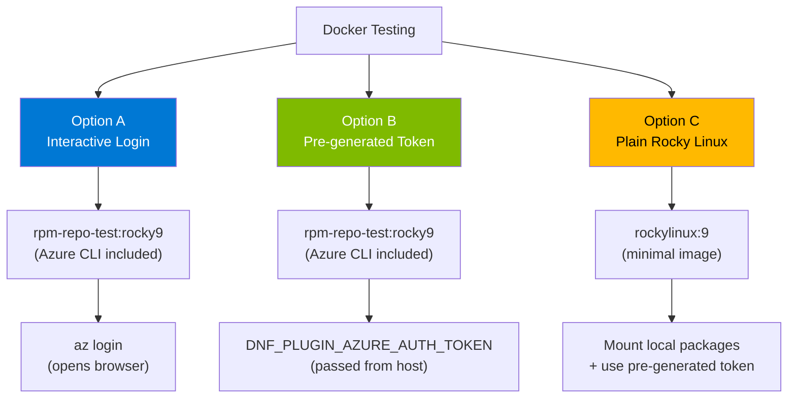

#### Build the Test Image

```bash
docker build -f Dockerfile.rpm-test -t rpm-repo-test:rocky9 .
```

#### Option A: Interactive Login (Development)

```bash
source .env.generated

docker run --rm -it \
  -e AZURE_STORAGE_ACCOUNT="$AZURE_STORAGE_ACCOUNT" \
  rpm-repo-test:rocky9

# Inside the container:
az login
setup-azure-repo.sh
dnf makecache
dnf --disablerepo="*" --enablerepo="azure-rpm-repo" list available
dnf install -y hello-azure
hello-azure --info
```

#### Option B: Pre-generated Token (CI/CD or Headless)

```bash
source .env.generated
TOKEN=$(az account get-access-token --resource https://storage.azure.com --query accessToken -o tsv)

docker run --rm -it \
  -e DNF_PLUGIN_AZURE_AUTH_TOKEN="$TOKEN" \
  -e AZURE_STORAGE_ACCOUNT="$AZURE_STORAGE_ACCOUNT" \
  rpm-repo-test:rocky9 bash -c '
    setup-azure-repo.sh
    dnf makecache
    dnf --disablerepo="*" --enablerepo="azure-rpm-repo" list available
    dnf install -y hello-azure
    hello-azure --info
'
```

#### Option C: Plain Rocky Linux (Minimal - Token Only)

For scenarios without Azure CLI pre-installed:

```bash
source .env.generated
TOKEN=$(az account get-access-token --resource https://storage.azure.com --query accessToken -o tsv)

docker run --rm -it \
  -e DNF_PLUGIN_AZURE_AUTH_TOKEN="$TOKEN" \
  -e AZURE_STORAGE_ACCOUNT="$AZURE_STORAGE_ACCOUNT" \
  -v $(pwd)/packages:/packages:ro \
  rockylinux:9 bash -c '
    dnf install -y /packages/dnf-plugin-azure-auth-*.rpm
    echo "[azure-rpm-repo]" >> /etc/dnf/plugins/azure_auth.conf
    cat > /etc/yum.repos.d/azure.repo << EOF
[azure-rpm-repo]
name=Azure Blob RPM Repository
baseurl=https://${AZURE_STORAGE_ACCOUNT}.blob.core.windows.net/rpm-repo/el9/x86_64
enabled=1
gpgcheck=0
EOF
    dnf makecache
    dnf repolist
    dnf list --repo azure-rpm-repo
    dnf install -y hello-azure
    hello-azure --info
'
```

---

## Phase 5: End-to-End Test

Run the complete pipeline with a single command:

```bash
# Full E2E test - creates infrastructure, builds, uploads, and tests
./scripts/e2e-test.sh -g rg-rpm-poc

# Use existing storage account (skip storage creation)
./scripts/e2e-test.sh -s $AZURE_STORAGE_ACCOUNT --skip-storage

# Skip build (use pre-built packages)
./scripts/e2e-test.sh -s $AZURE_STORAGE_ACCOUNT --skip-storage --skip-build
```

---

## Phase 6: Azure VM Testing with Managed Identity

### Architecture

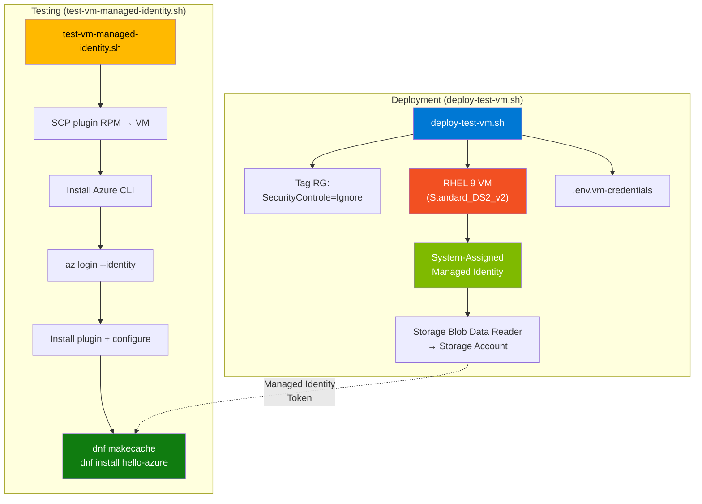

### Deploy RHEL 9 Test VM

```bash
# Install sshpass (required once for SSH automation)
sudo apt-get install -y sshpass

# Deploy VM with managed identity (reads config from .env.generated)
./scripts/deploy-test-vm.sh

# Or with explicit parameters
./scripts/deploy-test-vm.sh \
  --resource-group rg-rpm-poc \
  --storage-account $AZURE_STORAGE_ACCOUNT \
  --vm-name rpm-test-vm \
  --vm-size Standard_DS2_v2
```

**What this script does:**
- Tags the resource group with `SecurityControle=Ignore`
- Generates a secure admin password
- Accepts RHEL marketplace image terms
- Creates a RHEL 9 VM with system-assigned managed identity
- Assigns **Storage Blob Data Reader** role to the VM's identity
- Waits for RBAC propagation (30 seconds)
- Saves credentials to `.env.vm-credentials`

### Run Managed Identity Test

```bash
# Test the full managed identity workflow
./scripts/test-vm-managed-identity.sh

# Or with explicit parameters
./scripts/test-vm-managed-identity.sh \
  --vm-ip <VM_PUBLIC_IP> \
  --vm-user azureuser \
  --vm-password '<password>' \
  --storage-account $AZURE_STORAGE_ACCOUNT
```

**Test steps executed on the VM:**
1. Install Azure CLI
2. Login with managed identity (`az login --identity`)
3. Upload plugin RPM via SCP (bootstrapping)
4. Install `dnf-plugin-azure-auth`
5. Configure plugin and repository
6. `dnf makecache` (tests managed identity token injection)
7. List packages from Azure Blob repo
8. Install `hello-azure`
9. Verify token source is managed identity

### Clean Up VM

```bash
# Delete just the VM
az vm delete --name rpm-test-vm --resource-group rg-rpm-poc --yes

# Or delete entire resource group
az group delete --name rg-rpm-poc --yes --no-wait
```

---

## Docker Images

This project includes two Dockerfiles for building and testing RPM packages.

### Dockerfile.rpm-builder

**Purpose:** RPM build environment with all tooling needed to compile packages and manage repositories.

| Property | Value |
|----------|-------|
| **Base image** | `rockylinux:8` |
| **Key packages** | `rpm-build`, `rpmdevtools`, `rpmlint`, `createrepo_c`, `azure-cli`, `python3` |
| **Workspace** | `/workspace` |
| **Built-in scripts** | `/scripts/build-rpm.sh`, `/scripts/update-repo.sh`, `/scripts/upload-to-azure.sh` |

**Build and run:**
```bash
docker build -f Dockerfile.rpm-builder -t rpm-builder .

# Interactive use
docker run --rm -it \
  -v $(pwd)/specs:/workspace/specs:ro \
  -v $(pwd)/sources:/workspace/sources:ro \
  -v $(pwd)/packages:/workspace/packages \
  rpm-builder bash
```

**Used by docker-compose as the `rpm-builder` service** -- builds test packages and optionally uploads to Azure.

### Dockerfile.rpm-test

**Purpose:** Pre-configured test client for validating Azure Blob RPM repository access with Azure AD authentication.

| Property | Value |
|----------|-------|
| **Base image** | `rockylinux:9` |
| **Key packages** | `azure-cli` (pip), `dnf-plugin-azure-auth` (pre-installed from `packages/`) |
| **Helper script** | `setup-azure-repo.sh` -- configures the plugin and creates the repo file |
| **Auth modes** | Interactive (`az login`) or pre-generated token (`DNF_PLUGIN_AZURE_AUTH_TOKEN`) |

**Build and run:**
```bash
docker build -f Dockerfile.rpm-test -t rpm-repo-test:rocky9 .

# With interactive login
docker run --rm -it \
  -e AZURE_STORAGE_ACCOUNT="$AZURE_STORAGE_ACCOUNT" \
  rpm-repo-test:rocky9

# With pre-generated token
TOKEN=$(az account get-access-token --resource https://storage.azure.com --query accessToken -o tsv)
docker run --rm -it \
  -e DNF_PLUGIN_AZURE_AUTH_TOKEN="$TOKEN" \
  -e AZURE_STORAGE_ACCOUNT="$AZURE_STORAGE_ACCOUNT" \
  rpm-repo-test:rocky9 bash -c 'setup-azure-repo.sh && dnf install -y hello-azure'
```

### Docker Compose

The `docker-compose.yml` defines a multi-container test environment:

| Service | Image | Purpose |
|---------|-------|---------|
| `rpm-builder` | `Dockerfile.rpm-builder` | Builds RPMs and creates repo metadata |
| `fedora-client` | `fedora:39` | Test DNF access on Fedora |
| `rocky-client` | `rockylinux:9` | Test DNF access on Rocky Linux 9 |
| `alma-client` | `almalinux:9` | Test DNF access on AlmaLinux 9 |
| `rhel-ubi-client` | `registry.access.redhat.com/ubi9/ubi:latest` | Test on Red Hat UBI 9 |
| `shell` | `fedora:39` | Interactive shell for manual testing |

```bash
# Run the builder
docker compose up rpm-builder

# Test on specific distro
REPO_URL="https://$AZURE_STORAGE_ACCOUNT.blob.core.windows.net/rpm-repo/el9/x86_64" \
  docker compose up rocky-client

# Interactive shell
docker compose run shell
```

---

## DNF Plugin for Azure AD

The `dnf-plugin-azure-auth` package provides automatic Azure AD token injection for DNF/YUM.

### Plugin Decision Flow

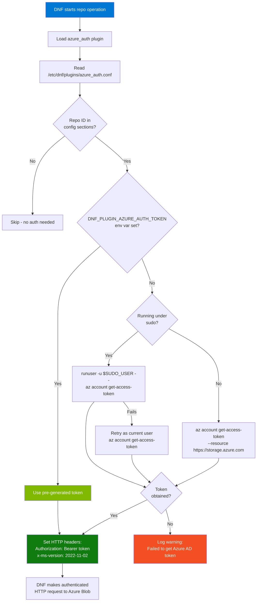

### Plugin Files

| File | Location on Client | Purpose |
|------|----------|---------|
| `azure_auth.py` | `/usr/lib/python3/site-packages/dnf-plugins/` | Plugin code |
| `azure_auth.conf` | `/etc/dnf/plugins/` | Plugin configuration |

### Configuration Format

```ini
# /etc/dnf/plugins/azure_auth.conf
[main]
enabled=1

# Add a section for each repository that needs Azure AD auth.
# The section name must match the repository ID in yum.repos.d.
[azure-rpm-repo]
# Empty section -- just having the section name enables auth for this repo.
```

---

## Client Configuration

### Client Setup Flow

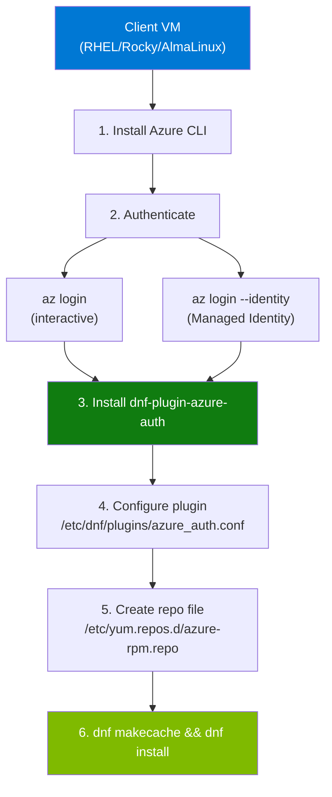

### For RHEL/Rocky Linux/AlmaLinux VMs

```bash
# 1. Install Azure CLI
sudo rpm --import https://packages.microsoft.com/keys/microsoft.asc
sudo dnf config-manager --add-repo https://packages.microsoft.com/yumrepos/azure-cli
sudo dnf install -y azure-cli

# 2. Login to Azure
az login                  # Interactive
# OR
az login --identity       # Managed Identity (Azure VMs)

# 3. Install the Azure AD auth plugin
TOKEN=$(az account get-access-token --resource https://storage.azure.com --query accessToken -o tsv)
curl -H "Authorization: Bearer $TOKEN" -H "x-ms-version: 2022-11-02" \
  "https://STORAGE_ACCOUNT.blob.core.windows.net/rpm-repo/el9/x86_64/dnf-plugin-azure-auth-0.1.0-1.noarch.rpm" \
  -o /tmp/dnf-plugin-azure-auth.rpm
sudo dnf install -y /tmp/dnf-plugin-azure-auth.rpm

# 4. Configure the plugin
sudo tee -a /etc/dnf/plugins/azure_auth.conf << 'EOF'
[azure-rpm-repo]
EOF

# 5. Create repository configuration (replace YOUR_STORAGE_ACCOUNT)
sudo tee /etc/yum.repos.d/azure-rpm.repo << 'EOF'
[azure-rpm-repo]
name=Azure Blob RPM Repository
baseurl=https://YOUR_STORAGE_ACCOUNT.blob.core.windows.net/rpm-repo/el9/x86_64
enabled=1
gpgcheck=0
EOF

# 6. Test the repository
sudo dnf makecache
sudo dnf --disablerepo="*" --enablerepo="azure-rpm-repo" list available
sudo dnf install -y hello-azure
hello-azure --info
```

### For Azure VMs with Managed Identity

Azure VMs with Managed Identity can authenticate without storing credentials.

#### Managed Identity Architecture

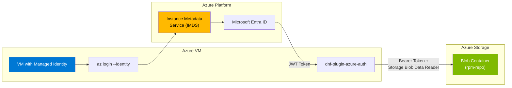

```bash
# --- On your workstation (assign RBAC) ---

# Enable Managed Identity on the VM (if not already)
az vm identity assign -g YOUR_RG -n YOUR_VM

# Get the VM's principal ID
VM_PRINCIPAL_ID=$(az vm show -g YOUR_RG -n YOUR_VM --query identity.principalId -o tsv)

# Get the storage account resource ID
STORAGE_ACCOUNT_ID=$(az storage account show -n YOUR_STORAGE_ACCOUNT -g YOUR_RG --query id -o tsv)

# Assign Storage Blob Data Reader role
az role assignment create \
  --role "Storage Blob Data Reader" \
  --assignee-object-id $VM_PRINCIPAL_ID \
  --assignee-principal-type ServicePrincipal \
  --scope $STORAGE_ACCOUNT_ID

# --- On the VM (SSH in) ---

# Login with Managed Identity (no credentials needed)
az login --identity
az account show

# Configure plugin and repo (same as standard setup above)
sudo tee -a /etc/dnf/plugins/azure_auth.conf << 'EOF'
[azure-rpm-repo]
EOF

sudo tee /etc/yum.repos.d/azure-rpm.repo << 'EOF'
[azure-rpm-repo]
name=Azure Blob RPM Repository
baseurl=https://YOUR_STORAGE_ACCOUNT.blob.core.windows.net/rpm-repo/el9/x86_64
enabled=1
gpgcheck=0
EOF

# Test -- tokens are fetched automatically via Managed Identity
sudo dnf makecache
sudo dnf install -y hello-azure
hello-azure --info
```

> **Security Best Practice**: Managed Identity eliminates the need to store credentials
> on the VM. The Azure platform automatically manages the identity lifecycle.

### Pre-generated Token (CI/CD, Bootstrapping)

For environments where Azure CLI cannot be installed:

```bash
# On a system with az cli, generate a token (valid ~1 hour)
TOKEN=$(az account get-access-token --resource https://storage.azure.com --query accessToken -o tsv)

# Pass to target system via environment variable
export DNF_PLUGIN_AZURE_AUTH_TOKEN="$TOKEN"

# The plugin will use this token instead of calling az cli
dnf install -y hello-azure
```

### Assigning RBAC Roles

```bash
# For users
az role assignment create \
  --role "Storage Blob Data Reader" \
  --assignee user@example.com \
  --scope /subscriptions/SUB_ID/resourceGroups/RG/providers/Microsoft.Storage/storageAccounts/ACCOUNT

# For Azure VMs with Managed Identity
VM_PRINCIPAL_ID=$(az vm show -g RG -n VM --query identity.principalId -o tsv)
az role assignment create \
  --role "Storage Blob Data Reader" \
  --assignee-object-id $VM_PRINCIPAL_ID \
  --scope /subscriptions/SUB_ID/resourceGroups/RG/providers/Microsoft.Storage/storageAccounts/ACCOUNT

# For Service Principals
az role assignment create \
  --role "Storage Blob Data Reader" \
  --assignee SP_APP_ID \
  --scope /subscriptions/SUB_ID/resourceGroups/RG/providers/Microsoft.Storage/storageAccounts/ACCOUNT
```

---

## CI/CD Integration

### Pipeline Architecture

```mermaid
graph LR
    subgraph "Source Control"
        Push["Push to main"]
    end

    subgraph "CI/CD Pipeline"
        Login["Azure Login<br/>(Service Principal)"]
        InstallTools["Install Build Tools<br/>(rpm, createrepo_c)"]
        BuildRPMs["Build RPMs<br/>(rpmbuild -bb)"]
        CreateRepo["Create Repo Metadata<br/>(createrepo_c)"]
        UploadAz["Upload to Azure Blob<br/>(az storage blob upload)"]

        Login --> InstallTools --> BuildRPMs --> CreateRepo --> UploadAz
    end

    subgraph "Azure"
        BlobCI["Azure Blob Storage<br/>(rpm-repo)"]
    end

    Push --> Login
    UploadAz -- "Bearer Token +<br/>Storage Blob Data Contributor" --> BlobCI

    style Push fill:#F25022,color:#fff
    style BuildRPMs fill:#FFB900,color:#000
    style BlobCI fill:#0078D4,color:#fff
```

### Azure DevOps Pipeline

See [`azure-pipelines.yml`](azure-pipelines.yml) for the full pipeline. Summary:

```yaml
trigger:
  branches:
    include: [main]

stages:
  - stage: Build
    # Uses Fedora 39 container, installs rpm-build + createrepo_c
    # Builds all specs, publishes RPM artifacts

  - stage: CreateRepository
    # Downloads RPMs, runs createrepo_c, publishes repo artifact

  - stage: Publish  # Only on main branch
    # Uploads repo to Azure Blob Storage using AzureCLI@2 task

  - stage: Test
    # Verifies repository access with Azure AD token
```

**Setup requirements:**
1. Create a Variable Group `rpm-repo-secrets` with `STORAGE_ACCOUNT_NAME`
2. Create an Azure Service Connection
3. Ensure the service principal has `Storage Blob Data Contributor` role

### GitHub Actions Example

```yaml
name: Build and Publish RPM

on:
  push:
    branches: [main]

jobs:
  build:
    runs-on: ubuntu-latest

    steps:
      - uses: actions/checkout@v4

      - name: Azure Login
        uses: azure/login@v1
        with:
          creds: ${{ secrets.AZURE_CREDENTIALS }}

      - name: Install Build Tools
        run: sudo apt-get update && sudo apt-get install -y rpm createrepo-c

      - name: Build RPMs
        run: ./scripts/build-rpm-local.sh all

      - name: Upload to Azure
        run: |
          ./scripts/upload-to-azure.sh \
            --storage-account ${{ vars.AZURE_STORAGE_ACCOUNT }}
```

---

## Troubleshooting

### Diagnostic Decision Tree

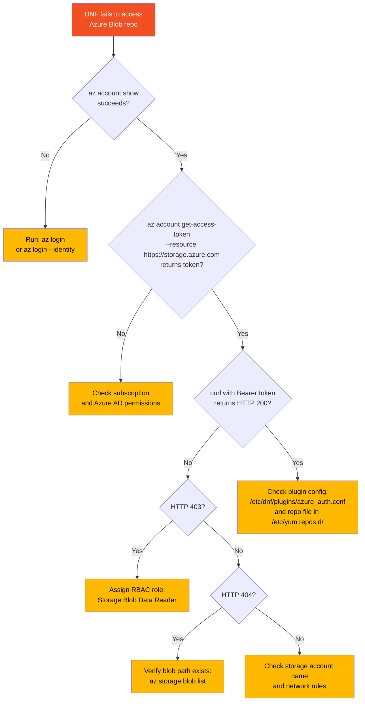

### Common Errors

| Error | Cause | Solution |
|-------|-------|----------|
| `AuthorizationPermissionMismatch` | Missing RBAC role | Assign `Storage Blob Data Reader` or `Contributor` |
| `AuthenticationFailed` | Invalid or expired token | Run `az login` |
| `403 Forbidden` | Missing RBAC / expired token | Verify role assignment and token |
| `Failed to get Azure AD token` | Not logged in or Managed Identity not configured | Run `az login` or check MI config |
| `Key based authentication is not permitted` | Azure Policy blocking shared keys | Use Azure AD auth (this solution does) |
| `Public access is not permitted` | Azure Policy blocking public access | Use Azure AD auth (this solution does) |
| `ResourceNotFound` / `repomd.xml not found` | Wrong path or metadata not uploaded | Verify URL, run `upload-to-azure.sh` |
| `Could not resolve host` | Wrong storage account name | Verify storage account name |
| `Token expired` | Tokens valid ~1 hour | Plugin refreshes automatically; re-run `az login` if needed |

### Error: "AuthorizationPermissionMismatch"

```bash
# Verify role assignment
az role assignment list \
  --scope $(az storage account show -n $AZURE_STORAGE_ACCOUNT -g $AZURE_RESOURCE_GROUP --query id -o tsv) \
  --output table

# Assign if missing
az role assignment create \
  --role "Storage Blob Data Contributor" \
  --assignee $(az ad signed-in-user show --query id -o tsv) \
  --scope $(az storage account show -n $AZURE_STORAGE_ACCOUNT -g $AZURE_RESOURCE_GROUP --query id -o tsv)
```

### Error: "Failed to get Azure AD token"

```bash
az account show       # Check login status
az login              # Re-login if needed
az login --identity --debug   # Debug Managed Identity issues
```

### Error: "403 Forbidden"

```bash
TOKEN=$(az account get-access-token --resource https://storage.azure.com --query accessToken -o tsv)
echo $TOKEN | cut -c1-50  # Verify token looks valid (starts with eyJ)

curl -v -H "Authorization: Bearer $TOKEN" -H "x-ms-version: 2022-11-02" \
  "https://$AZURE_STORAGE_ACCOUNT.blob.core.windows.net/$AZURE_STORAGE_CONTAINER/el9/x86_64/repodata/repomd.xml"
```

### Error: "repomd.xml not found"

```bash
# Check if metadata was uploaded
az storage blob list \
  --account-name $AZURE_STORAGE_ACCOUNT \
  --container-name $AZURE_STORAGE_CONTAINER \
  --prefix "el9/x86_64/repodata/" \
  --auth-mode login \
  --output table

# If missing, regenerate and upload
createrepo_c packages/
./scripts/upload-to-azure.sh
```

### Error: "Cannot rename .repodata/ -> repodata/" (WSL)

When running `createrepo_c` on WSL's `/mnt/c/` filesystem, the atomic directory rename fails because Windows-mounted paths don't support this operation.

```bash
# Workaround: Use a native Linux temp directory
rm -rf packages/repodata
mkdir -p /tmp/rpm-repo-build
cp packages/*.rpm /tmp/rpm-repo-build/
createrepo_c /tmp/rpm-repo-build/
cp -r /tmp/rpm-repo-build/repodata packages/
rm -rf /tmp/rpm-repo-build

./scripts/upload-to-azure.sh
```

> This only affects WSL users building on `/mnt/c/`. Native Linux and Docker builds are not affected.

### Plugin Debugging

```bash
DNF_DEBUG=1 dnf makecache                    # Enable debug output
dnf info dnf-plugin-azure-auth               # Check plugin is installed
cat /etc/dnf/plugins/azure_auth.conf         # Verify plugin config
cat /etc/yum.repos.d/azure-rpm.repo          # Check repo config
sudo dnf makecache -v                        # Verbose mode shows token info
```

---

## Verification Checklist

| Step | Command | Expected Result |
|------|---------|-----------------|
| Azure Login | `az account show` | Shows your subscription |
| Storage Created | `az storage account show -n $AZURE_STORAGE_ACCOUNT` | Returns account details |
| RBAC Role | `az role assignment list --scope ...` | Shows Storage Blob Data Contributor |
| Packages Built | `ls packages/*.rpm` | Shows RPM files |
| Repo Metadata | `ls packages/repodata/` | Shows repomd.xml, etc. |
| Blobs Uploaded | `az storage blob list -c $AZURE_STORAGE_CONTAINER --account-name $AZURE_STORAGE_ACCOUNT --auth-mode login` | Shows uploaded files |
| Azure AD Token | `az account get-access-token --resource https://storage.azure.com` | Returns valid token |
| HTTP Access | `curl -H "Authorization: Bearer $TOKEN" -H "x-ms-version: 2022-11-02" https://...repomd.xml` | Returns XML content |

---

## Reference

### Environment Variables

| Variable | Purpose |
|----------|---------|
| `AZURE_STORAGE_ACCOUNT` | Storage account name |
| `AZURE_STORAGE_CONTAINER` | Blob container name (default: `rpm-repo`) |
| `AZURE_RESOURCE_GROUP` | Resource group name |
| `REPO_PATH` | Path within container (e.g., `el9/x86_64`) |
| `DNF_PLUGIN_AZURE_AUTH_TOKEN` | Pre-generated Azure AD token for the plugin |

### HTTP Headers for Azure Blob

| Header | Value | Purpose |
|--------|-------|---------|
| `Authorization` | `Bearer <token>` | Azure AD authentication |
| `x-ms-version` | `2022-11-02` | Azure Storage API version |

### Scripts Reference

| Script | Purpose |
|--------|---------|
| `create-azure-storage.sh` | Create storage account with RBAC |
| `build-rpm-local.sh` | Build RPM packages locally |
| `upload-to-azure.sh` | Upload packages to Azure Blob |
| `test-repository.sh` | Test repository accessibility |
| `e2e-test.sh` | End-to-end pipeline test |
| `deploy-test-vm.sh` | Deploy RHEL 9 test VM with managed identity |
| `test-vm-managed-identity.sh` | Test managed identity RPM repo access on VM |
| `generate-random-rpms.sh` | Generate random test packages |
| `docker-build-and-upload.sh` | Build & upload inside Docker container |

### External Resources

- [dnf-plugin-azure-auth (Metaswitch)](https://github.com/Metaswitch/dnf-plugin-azure-auth)
- [Azure Blob Storage REST API](https://docs.microsoft.com/en-us/rest/api/storageservices/blob-service-rest-api)
- [Azure AD Authentication for Storage](https://docs.microsoft.com/en-us/azure/storage/common/storage-auth-aad)
- [Azure RBAC for Storage](https://learn.microsoft.com/azure/storage/common/storage-auth-aad-rbac-portal)
- [DNF Plugin Development](https://dnf.readthedocs.io/en/latest/api_plugins.html)

---

## Next Steps

1. **Add GPG Signing** -- Sign packages for production use
2. **Multiple Architectures** -- Add support for aarch64
3. **Azure DevOps Pipeline** -- See [azure-pipelines.yml](azure-pipelines.yml)
4. **Private Endpoints** -- For VNet-restricted access
5. **Monitoring** -- Add Azure Monitor alerts for access issues

---

## License

The `dnf-plugin-azure-auth` component is based on [Metaswitch/dnf-plugin-azure-auth](https://github.com/Metaswitch/dnf-plugin-azure-auth) and is licensed under the **GNU General Public License v2.0 (GPL-2.0)**. See the [GPL-2.0 license text](https://www.gnu.org/licenses/old-licenses/gpl-2.0.html) for details.

All other code in this POC (scripts, specs for test packages, Dockerfiles, configuration) is provided for educational and testing purposes.
