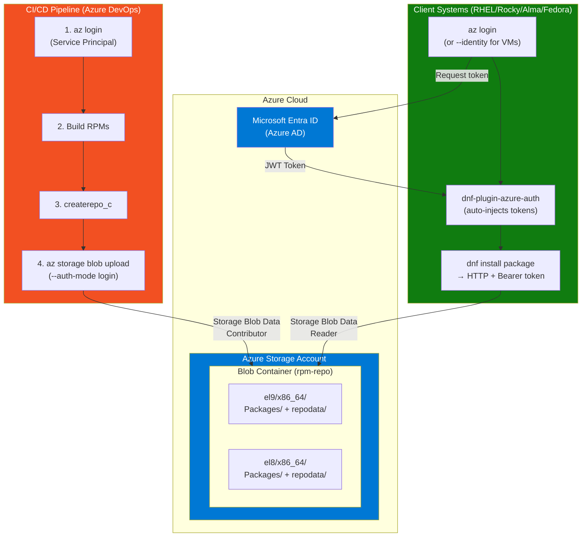
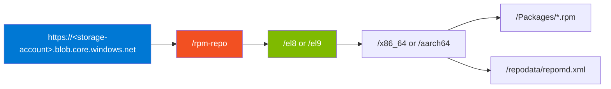
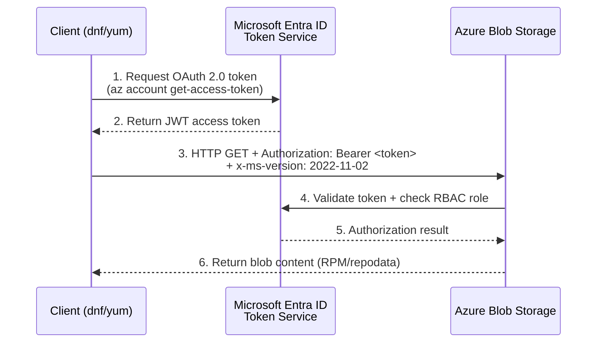
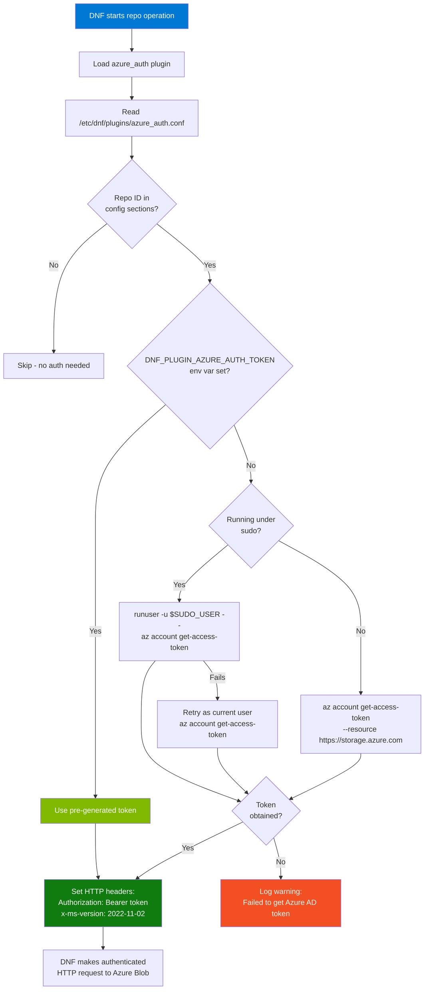
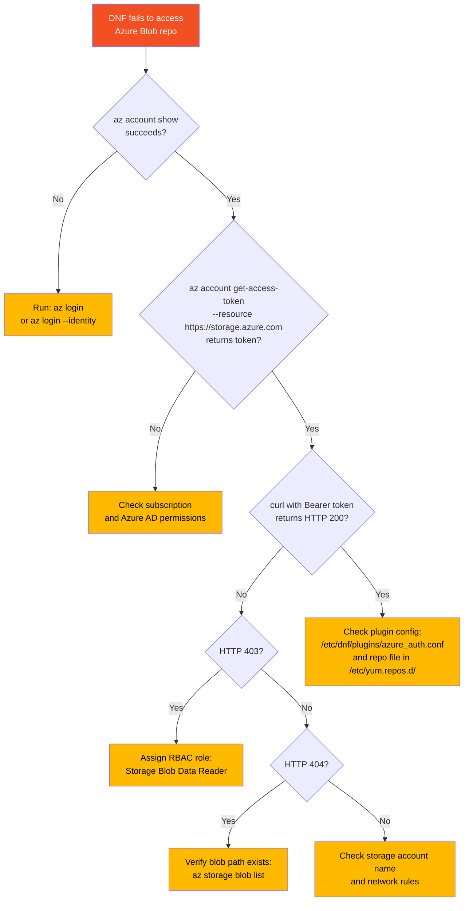

# Azure Blob Storage RPM Repository - Implementation Guide

## Table of Contents

1. [Overview](#overview)
2. [Architecture](#architecture)
3. [Prerequisites](#prerequisites)
4. [Azure AD Authentication](#azure-ad-authentication)
5. [Infrastructure Setup](#infrastructure-setup)
6. [Building RPM Packages](#building-rpm-packages)
7. [DNF Plugin for Azure AD](#dnf-plugin-for-azure-ad)
8. [Client Configuration](#client-configuration)
9. [CI/CD Integration](#cicd-integration)
10. [Troubleshooting](#troubleshooting)
11. [Reference](#reference)

---

## Overview

This guide provides a comprehensive implementation for hosting RPM packages on Azure Blob Storage using **Azure AD authentication**. This solution is designed for enterprise environments where:

- **SAS tokens and storage keys are blocked** by Azure Policy
- **Public blob access is disabled** for security compliance
- **RBAC-based access control** is required
- **Managed Identities** are preferred for Azure VMs

### Key Components

| Component | Purpose |
|-----------|---------|
| Azure Blob Storage | Host RPM packages and repository metadata |
| Azure AD Authentication | Secure access via RBAC roles |
| `dnf-plugin-azure-auth` | DNF plugin that injects Azure AD tokens |
| `createrepo_c` | Generate yum/dnf repository metadata |

---

## Architecture

### High-Level Architecture



### Repository URL Structure



---

## Prerequisites

### Required Tools

| Tool | Purpose | Installation |
|------|---------|--------------|
| Azure CLI | Azure resource management | `curl -sL https://aka.ms/InstallAzureCLIDeb \| sudo bash` |
| rpm / rpmbuild | Build RPM packages | `apt install rpm` (Debian) or `dnf install rpm-build` (RHEL) |
| createrepo_c | Repository metadata generation | `apt install createrepo-c` or `dnf install createrepo_c` |

### Azure Resources

1. **Azure Subscription** with contributor access
2. **Azure AD permissions** to assign RBAC roles
3. **Resource Group** for organizing resources

---

## Azure AD Authentication

This solution uses Azure AD (Entra ID) authentication exclusively. No SAS tokens or storage keys are required or supported.

### Authentication Flow



### RBAC Roles

| Role | Purpose | Scope |
|------|---------|-------|
| **Storage Blob Data Contributor** | Upload packages, update repository | Storage Account or Container |
| **Storage Blob Data Reader** | Download packages (client systems) | Storage Account or Container |

### Token Acquisition Methods

| Method | Use Case | Command |
|--------|----------|---------|
| Interactive Login | Development, testing | `az login` |
| Device Code | Headless systems | `az login --use-device-code` |
| Service Principal | CI/CD pipelines | `az login --service-principal` |
| Managed Identity | Azure VMs | `az login --identity` |

---

## Infrastructure Setup

### Create Storage Account with RBAC

```bash
# Run the provided script
./scripts/create-azure-storage.sh -g rg-rpm-poc --location eastus
```

The script will:
1. Create a resource group
2. Create a storage account with a unique name
3. Create a blob container
4. Assign **Storage Blob Data Contributor** role to your user
5. Generate `.env.generated` with configuration

### Manual Setup (Alternative)

```bash
# Set variables
RESOURCE_GROUP="rg-rpm-repo"
STORAGE_ACCOUNT="rpmrepo$(date +%s | tail -c 6)"
CONTAINER_NAME="rpm-repo"
LOCATION="eastus"

# Create resource group
az group create --name $RESOURCE_GROUP --location $LOCATION

# Create storage account
az storage account create \
  --name $STORAGE_ACCOUNT \
  --resource-group $RESOURCE_GROUP \
  --location $LOCATION \
  --sku Standard_LRS \
  --kind StorageV2 \
  --https-only true \
  --min-tls-version TLS1_2

# Create container
az storage container create \
  --name $CONTAINER_NAME \
  --account-name $STORAGE_ACCOUNT \
  --auth-mode login

# Get current user's object ID
USER_ID=$(az ad signed-in-user show --query id -o tsv)

# Assign Storage Blob Data Contributor role
STORAGE_ID=$(az storage account show -n $STORAGE_ACCOUNT -g $RESOURCE_GROUP --query id -o tsv)
az role assignment create \
  --role "Storage Blob Data Contributor" \
  --assignee $USER_ID \
  --scope $STORAGE_ID
```

---

## Building RPM Packages

### Local Build (Debian/Ubuntu WSL)

```bash
# Install prerequisites
sudo apt-get update && sudo apt-get install -y rpm createrepo-c

# Build all packages
./scripts/build-rpm-local.sh all
```

### Build Output

```
packages/
├── hello-azure-1.0.0-1.noarch.rpm
├── dnf-plugin-azure-auth-0.1.0-1.noarch.rpm
└── repodata/
    ├── repomd.xml
    ├── primary.xml.gz
    ├── filelists.xml.gz
    └── other.xml.gz
```

### Upload to Azure

```bash
source .env.generated
./scripts/upload-to-azure.sh
```

---

## DNF Plugin for Azure AD

The `dnf-plugin-azure-auth` package provides automatic Azure AD token injection for DNF/YUM.

### Plugin Decision Flow



### How It Works

1. Plugin loads and identifies repositories with `*.blob.core.windows.net` URLs
2. Before each request, plugin checks if repo is configured in `/etc/dnf/plugins/azure_auth.conf`
3. Plugin obtains Azure AD token via:
   - `DNF_PLUGIN_AZURE_AUTH_TOKEN` environment variable (if set)
   - `az account get-access-token --resource https://storage.azure.com`
4. Plugin adds HTTP headers to requests:
   - `Authorization: Bearer <token>`
   - `x-ms-version: 2022-11-02`

### Plugin Files

| File | Location | Purpose |
|------|----------|---------|
| `azure_auth.py` | `/usr/lib/python3/site-packages/dnf-plugins/` | Plugin code |
| `azure_auth.conf` | `/etc/dnf/plugins/` | Plugin configuration |

### Configuration Format

```ini
# /etc/dnf/plugins/azure_auth.conf
[main]
enabled=1

# Add a section for each repository that needs Azure AD auth
# The section name must match the repository ID in yum.repos.d

[azure-rpm-repo]
# Empty section - just having the section name enables auth for this repo
```

---

## Client Configuration

### Standard Client Setup

```bash
# 1. Install Azure CLI
curl -sL https://aka.ms/InstallAzureCLIDeb | sudo bash  # Debian/Ubuntu
# OR
sudo dnf install azure-cli  # RHEL/Fedora (if available in repos)

# 2. Install the Azure AD auth plugin
# (Download from your repo or build locally)
sudo dnf install dnf-plugin-azure-auth

# 3. Login to Azure
az login  # Interactive
# OR
az login --identity  # Managed Identity on Azure VMs

# 4. Configure the plugin
sudo tee -a /etc/dnf/plugins/azure_auth.conf << 'EOF'
[azure-rpm-repo]
EOF

# 5. Create repository file
sudo tee /etc/yum.repos.d/azure-rpm.repo << 'EOF'
[azure-rpm-repo]
name=Azure Blob RPM Repository
baseurl=https://STORAGE_ACCOUNT.blob.core.windows.net/rpm-repo/el9/x86_64
enabled=1
gpgcheck=0
EOF

# 6. Test
sudo dnf makecache
sudo dnf install hello-azure
```

### Azure VM with Managed Identity

```bash
# 1. Enable System-assigned Managed Identity on VM
az vm identity assign -g RESOURCE_GROUP -n VM_NAME

# 2. Assign Storage Blob Data Reader role
VM_PRINCIPAL_ID=$(az vm show -g RESOURCE_GROUP -n VM_NAME --query identity.principalId -o tsv)
STORAGE_SCOPE="/subscriptions/SUBSCRIPTION_ID/resourceGroups/RG/providers/Microsoft.Storage/storageAccounts/ACCOUNT"

az role assignment create \
  --role "Storage Blob Data Reader" \
  --assignee-object-id $VM_PRINCIPAL_ID \
  --assignee-principal-type ServicePrincipal \
  --scope $STORAGE_SCOPE

# 3. On the VM
az login --identity
# Configure plugin and repo as above
```

### Pre-generated Token (CI/CD)

For environments where Azure CLI cannot be installed:

```bash
# On a system with az cli, generate token
TOKEN=$(az account get-access-token --resource https://storage.azure.com --query accessToken -o tsv)

# Pass to target system via environment variable
export DNF_PLUGIN_AZURE_AUTH_TOKEN="$TOKEN"

# Plugin will use this token instead of calling az cli
dnf install -y hello-azure
```

---

## CI/CD Integration

### Pipeline Architecture

```mermaid
graph LR
    subgraph "Source Control"
        Push["Push to main"]
    end

    subgraph "CI/CD Pipeline"
        Login["Azure Login<br/>(Service Principal)"]
        InstallTools["Install Build Tools<br/>(rpm, createrepo_c)"]
        BuildRPMs["Build RPMs<br/>(rpmbuild -bb)"]
        CreateRepo["Create Repo Metadata<br/>(createrepo_c)"]
        UploadAz["Upload to Azure Blob<br/>(az storage blob upload)"]

        Login --> InstallTools --> BuildRPMs --> CreateRepo --> UploadAz
    end

    subgraph "Azure"
        BlobCI["Azure Blob Storage<br/>(rpm-repo)"]
    end

    Push --> Login
    UploadAz -- "Bearer Token +<br/>Storage Blob Data Contributor" --> BlobCI

    style Push fill:#F25022,color:#fff
    style BuildRPMs fill:#FFB900,color:#000
    style BlobCI fill:#0078D4,color:#fff
```



### Azure DevOps Pipeline Example

```yaml
trigger:
  branches:
    include:
      - main

pool:
  vmImage: 'ubuntu-latest'

variables:
  AZURE_STORAGE_ACCOUNT: 'rpmrepopoc12345'
  AZURE_STORAGE_CONTAINER: 'rpm-repo'

stages:
  - stage: Build
    jobs:
      - job: BuildRPM
        steps:
          - task: AzureCLI@2
            displayName: 'Login to Azure'
            inputs:
              azureSubscription: 'YOUR_SERVICE_CONNECTION'
              scriptType: 'bash'
              scriptLocation: 'inlineScript'
              inlineScript: |
                az account show
          
          - script: |
              sudo apt-get update && sudo apt-get install -y rpm createrepo-c
            displayName: 'Install Build Tools'
          
          - script: |
              ./scripts/build-rpm-local.sh all
            displayName: 'Build RPM Packages'
          
          - task: AzureCLI@2
            displayName: 'Upload to Azure Blob'
            inputs:
              azureSubscription: 'YOUR_SERVICE_CONNECTION'
              scriptType: 'bash'
              scriptLocation: 'inlineScript'
              inlineScript: |
                ./scripts/upload-to-azure.sh \
                  --storage-account $(AZURE_STORAGE_ACCOUNT) \
                  --container $(AZURE_STORAGE_CONTAINER)
```

### GitHub Actions Example

```yaml
name: Build and Publish RPM

on:
  push:
    branches: [main]

jobs:
  build:
    runs-on: ubuntu-latest
    
    steps:
      - uses: actions/checkout@v4
      
      - name: Azure Login
        uses: azure/login@v1
        with:
          creds: ${{ secrets.AZURE_CREDENTIALS }}
      
      - name: Install Build Tools
        run: sudo apt-get update && sudo apt-get install -y rpm createrepo-c
      
      - name: Build RPMs
        run: ./scripts/build-rpm-local.sh all
      
      - name: Upload to Azure
        run: |
          ./scripts/upload-to-azure.sh \
            --storage-account ${{ vars.AZURE_STORAGE_ACCOUNT }}
```

---

## Troubleshooting

### Diagnostic Decision Tree



### Common Errors

| Error | Cause | Solution |
|-------|-------|----------|
| `AuthorizationPermissionMismatch` | Missing RBAC role | Assign Storage Blob Data Reader/Contributor |
| `AuthenticationFailed` | Invalid or expired token | Run `az login` |
| `Key based authentication is not permitted` | Azure Policy blocking shared keys | Use Azure AD auth (this solution) |
| `Public access is not permitted` | Azure Policy blocking public access | Use Azure AD auth (this solution) |
| `ResourceNotFound` | Wrong storage account or path | Verify URL and blob existence |

### Debug Commands

```bash
# Check Azure CLI login status
az account show

# Get and decode token (for debugging)
az account get-access-token --resource https://storage.azure.com

# Test blob access directly
TOKEN=$(az account get-access-token --resource https://storage.azure.com --query accessToken -o tsv)
curl -v \
  -H "Authorization: Bearer $TOKEN" \
  -H "x-ms-version: 2022-11-02" \
  "https://STORAGE_ACCOUNT.blob.core.windows.net/rpm-repo/el9/x86_64/repodata/repomd.xml"

# Check RBAC assignments
az role assignment list \
  --scope $(az storage account show -n STORAGE_ACCOUNT -g RESOURCE_GROUP --query id -o tsv) \
  --output table

# List blobs (verify upload)
az storage blob list \
  --account-name STORAGE_ACCOUNT \
  --container-name rpm-repo \
  --auth-mode login \
  --output table
```

### Plugin Debugging

```bash
# Enable DNF debug output
DNF_DEBUG=1 dnf makecache

# Check plugin is loaded
dnf info dnf-plugin-azure-auth

# Verify plugin configuration
cat /etc/dnf/plugins/azure_auth.conf

# Check repository configuration
cat /etc/yum.repos.d/azure-rpm.repo
```

---

## Reference

### Environment Variables

| Variable | Purpose |
|----------|---------|
| `AZURE_STORAGE_ACCOUNT` | Storage account name |
| `AZURE_STORAGE_CONTAINER` | Blob container name |
| `AZURE_RESOURCE_GROUP` | Resource group name |
| `REPO_PATH` | Path within container (e.g., `el9/x86_64`) |
| `DNF_PLUGIN_AZURE_AUTH_TOKEN` | Pre-generated Azure AD token for plugin |

### HTTP Headers for Azure Blob

| Header | Value | Purpose |
|--------|-------|---------|
| `Authorization` | `Bearer <token>` | Azure AD authentication |
| `x-ms-version` | `2022-11-02` | Azure Storage API version |

### Scripts Reference

| Script | Purpose |
|--------|---------|
| `create-azure-storage.sh` | Create storage account with RBAC |
| `build-rpm-local.sh` | Build RPM packages locally |
| `upload-to-azure.sh` | Upload packages to Azure Blob |
| `test-repository.sh` | Test repository accessibility |
| `e2e-test.sh` | End-to-end pipeline test |

### External Resources

- [Azure Blob Storage REST API](https://docs.microsoft.com/en-us/rest/api/storageservices/blob-service-rest-api)
- [Azure AD Authentication for Storage](https://docs.microsoft.com/en-us/azure/storage/common/storage-auth-aad)
- [dnf-plugin-azure-auth (Original)](https://github.com/Metaswitch/dnf-plugin-azure-auth)
- [DNF Plugin Development](https://dnf.readthedocs.io/en/latest/api_plugins.html)
